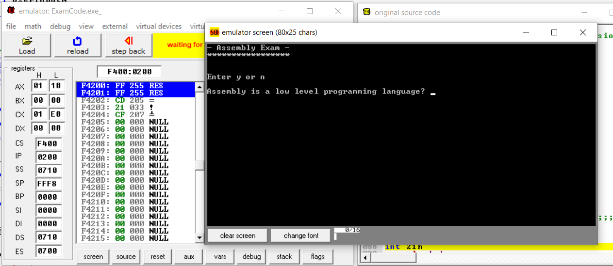
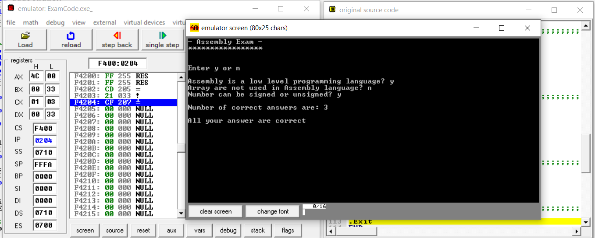
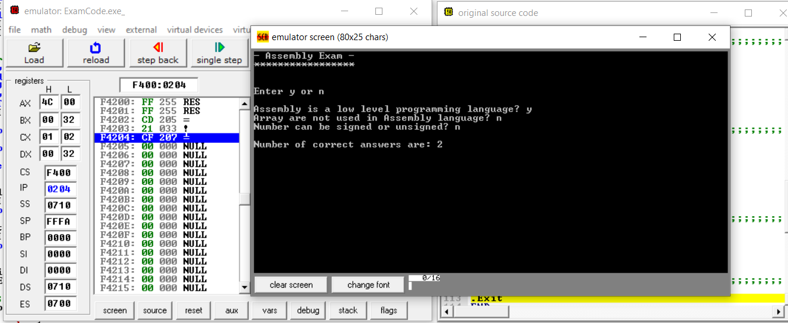
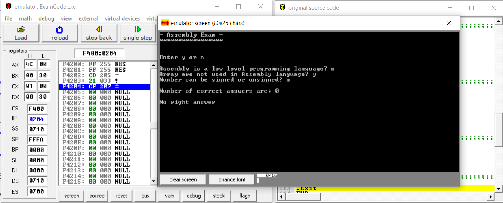

# Assembly Exam

> This Project is created using emu8086

It's like a quiz containing 3 questions and can be modified with some simple steps to have more

> This Program checks for the count of right answers with each questoin and keeps track of it for further operations

### Here are some screenshotd from the running program...

